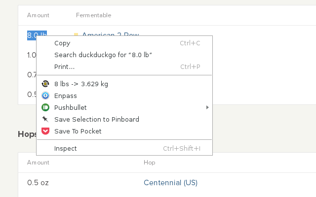

# Brew Convert

When browsing brewing recipes I encounter pages which are entirely imperial and heading off to another page or app to convert units was getting tedious. Enter *Brew Convert* which does the required conversions in the context menu on the page. No longer do you have to leave the page, just highlight the number and unit, and the conversion will show when you right click on the page. No units selected? Brew Converter will convert the number between some of the most common units. Configure to only convert imperial to metric or vice versa, or do both each time.

* Liters <-> Gallons(US)
* mg <-> oz
* kg <-> lbs
* Celcius <-> Fahrenheit
* EBC <-> Lovibond

## Screenshot

## Install

Brew convert is available for the following browsers:

The Opera extension is awaiting approval. Until then I am hosting it here. Download it by clicking the icon above and double click to add it to Opera. Then go to extensions and install it.

[View project on Github](https://github.com/Svenito/brewconvert)
